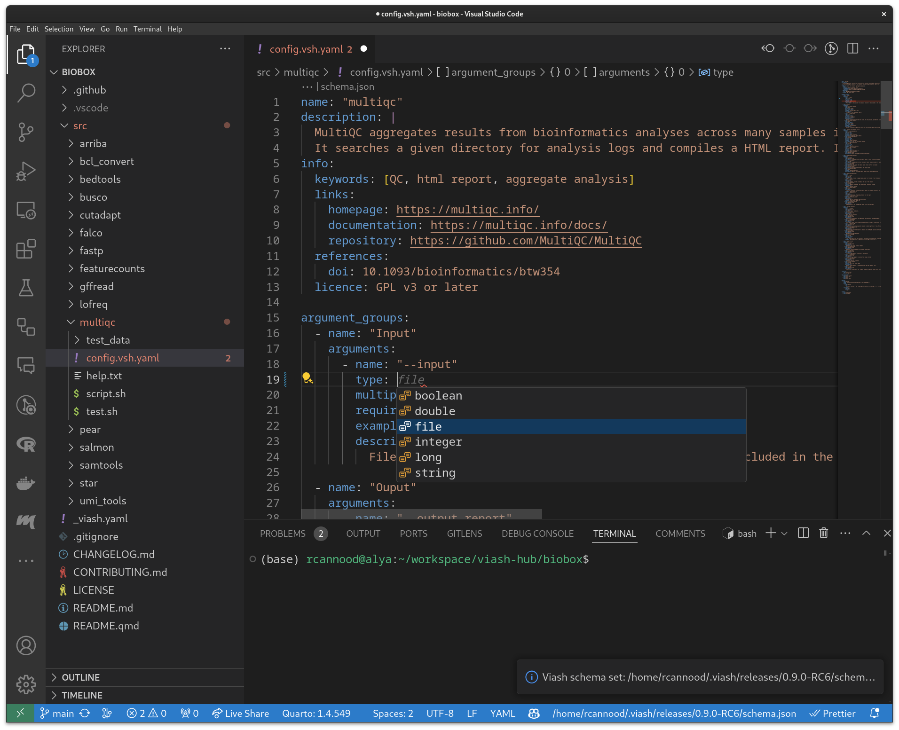

# viash-vscode

This extension provides language support for Viash components (`*.vsh.yaml`).



## Features

* Syntax highlighting and validation for Viash components (`*.vsh.yaml`).
* Support for validating Viash project config at `_viash.yaml`.
* Support for unit testing Viash components.

## Installation

Install the extension from the [Visual Studio Code Marketplace](https://marketplace.visualstudio.com/items?itemName=data-intuitive.viash).

## Requirements

Install Viash using [these instructions](https://viash.io/installation).

## Development

To contribute to the Viash VSCode extension, you need to have [Node.js](https://nodejs.org/) and [pnpm](https://pnpm.io/) installed.

To set up the development environment, clone the repository:

```bash
git clone git@github.com:viash-io/viash-vscode.git
cd viash-vscode
```

Then build the extension:

```bash
npm install
npm run package
```

This will create a `.vsix` file in the `dist` directory. You can then install this file in VSCode by going to the Extensions view, clicking on the three dots in the top right corner, and selecting "Install from VSIX...".
